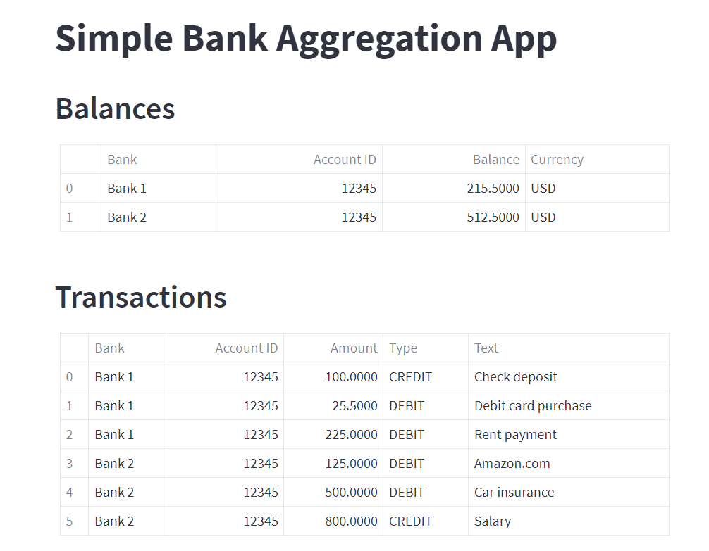

# simple-bank-aggregation
Simple bank aggregation application that pulls information from multiple different banks and displays it.

## Table of Contents
- [Installation](#installation)
- [Example](#examples)

## Installation

1. Clone repository
2. If the intention is to use back-end only:
   1. Run ```BankController.py```
3. If the intention is to use front-end:
   1. Install the framework Streamlit from streamlit.io
   2. Navigate on ```cmd``` to folder where ```BankControllerAsFramework.py``` is present
   3. Run command ```streamlit run BankControllerAsFramework.py```
   4. Browser should open

## Usage

Guidelines on how to use your project and any relevant code examples.

## Examples



Screenshot of Front-End.
